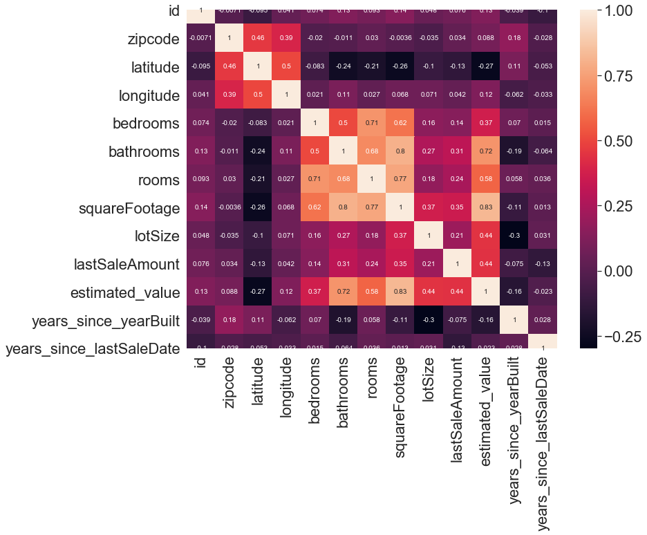
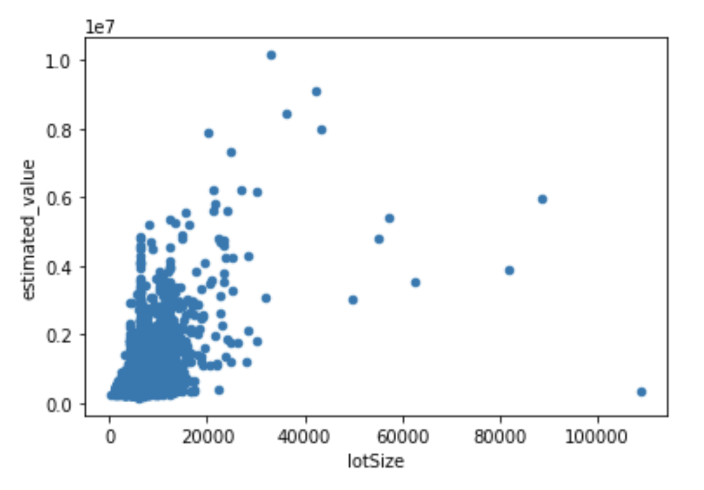
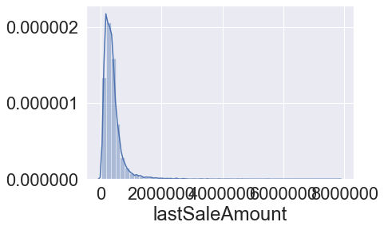
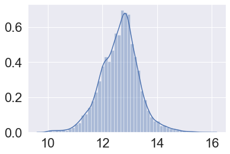
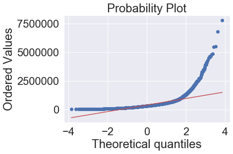
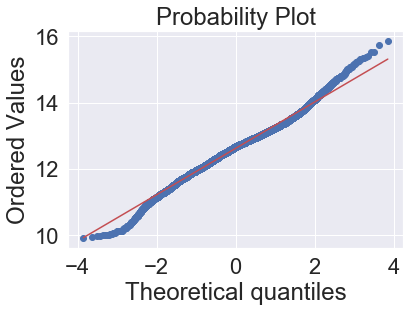
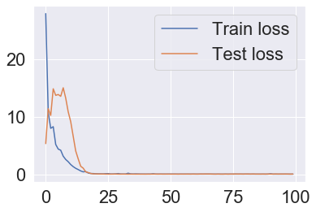
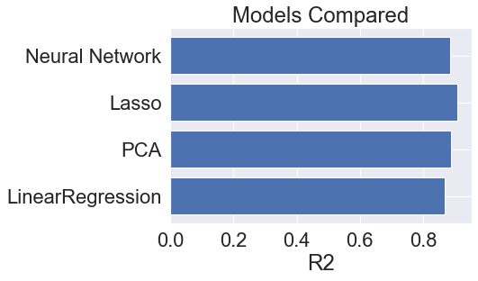

# Estimating House Prices in Denver
_James Allan Hall_

--

## Data and EDA
I start by reserving 15% of the data for a validation set.   Looking at data types and nulls, immediately I can see that there are a lot of nulls in the prior sales date and prior sales amount.  There are several data types that jump out as potential issues as well.

### Nulls
In looking deeper into the missing data for priorSaleAmount and priorSaleDate, I see that in addition to the nulls there are many priorSaleAmount of zero.  Together, nulls and zeros are over 33% of the set.  After much consideration, I decided to ignore these features for the time being, for the following reasons:

- The price is heavily dependent on the year of the sale
- Imputing 33% of both prior price and year could bias the dataset heavily
- Last Sale Amount and Last Sale year are much more widely available, so much of the information can be achieved from these features.

### Data Types
There are several data types that jump out as potential issues:

- priorSaleDate, yearBuilt, lastSaleDate could be more useful as datetime data types.
- priorSaleAmount is a float but estimated_value is int
- Zip codes are integers, but should really be categorical

In order to get the context from the dates into the models, I converted them to datetime dtypes.  However some models do not work with this datatype, so to maintain the context, I converted those to age, or years since yearBuilt, lastSale, etc.

The zipcodes are really more categorical than numerical, in that they are descriptive of a location, but the numbers may as well be neighborhood names. For this reason I apply one-hot encoding to the zips. In the event that there are new zipcodes from Denver not seen in the training data, I add a list of known Denver zipcodes to the category.

### Feature Correlations
Looking at a heatmap of the correlations of the features we get a sense how some of the feature dependencies.  We can see id has some correlation to some features like bathrooms (0.15) and estimated value (0.15).  I think this is most likely a coincidence as id's are presumably arbitrarily assigned.  I don't want this coincidence to influence the model so this will be a feature to drop.

### Outliers
In examining the paiplot, I can see that there are some outliers that may distort our model.  Its worth looking into to see what is going on with these outliers.  

Several features jump out to me.  As we describe the data, we can look at the extremes of each feature (zeros, negative numbers, worrisome std).

In looking at lotSize and estimated_value, the point on the right indicates a large lot size with a relatively low price. Perhaps this could be farmland? Whatever the reason, it does not seem to fit the pattern the other data is showing, so I'll delete this point.

## Feature Selection
There are several features that I can see are not likely to be useful in influencing price:

- id - arbitrarily assigned to houses.  We already have an index to identify listings.
- City, State - all listings are in Denver, CO so these will not influence our predictions.
- I dropped yearBuilt and lastSaleDate as well since we have that data converted to age.
- I dropped priorSaleAmount and priorSaleDate due to the abundunce of missing data (33%).  

Since there are some dependent features, I'm curious to see what kinds of feature interactions will influence the model.  Principal Component Analysis is a useful model for this analysis.  I used Polynomial feature interactions to expand our feature options, and then narrowed from there within the Lasso and PCA models.  

After looking at the distribution of some features, I tested assumptions of normal distribution and heteroskedasticity.  For features, including the target feature of estimated_value, that were heavily skewed, I transformed the data with a log function, which proved to work for most features in question. 

||
|:--:| 
| *Skew for this distribution is high* |

||
|:--:| 
| *log of target variable produces Gaussian Distribution, which makes models behave better*|

||
|:--:| 
|*Before taking the log the probability plot is misaligned*|

||
|:--:|
|*Here we see the probability plot with far better coverage for the log of the target variable*|

## Model Considerations
Given the data we are considering, a couple of models came to mind. 

Linear Regression - This makes for a good baseline for this project.

PCA - This model allows us to expand upon the feature interactions and reduce that high dimensionality down without losing too much information from those features.

Lasso - This is an excelent regularization model for feature selection, essentially zeroing out those features with the least influence.

Neural Network - I went with a simple model with 3 hidden layers and some dropout regularization to see if there may be some advancement over the Lasso technique.  

## Training

At the outset of this project, I set aside 20% of the data as a validation test set.  I split the 80% training dataset into a train and test split to train the models with the default 80/20 split.  

The data was used raw for the Linear regression model training.  For the other models it was scaled using a standard scalar.  The features chosen as valuable by the Lasso model were used to train the Neural Network.

The Neural Model took more tuning than the other models, because it has so many configuration possibilities and hyperparameters.  

## Evaluation
R2 scores were used to evaluate the models.  The Neural Network was also evaluated on the Loss (MSE) as it was being tuned.  The Lasso model performed the best based on the R2 scores from the validation set, so that is the model I will end up using for this evaluation.

The Neural Network could potentially perform better given more data.  After splitting, removing nulls and features, etc, the training set was around 11000, which is very small as NN's are concerned.  Given more time I could have augmented this set with synthetic data using a Generative Adversarial Network.  

||
|:--:|
|*Loss rate for Neural Network*|

||
|:--:|
|*Comparison of model performance by R2 validation score*|

